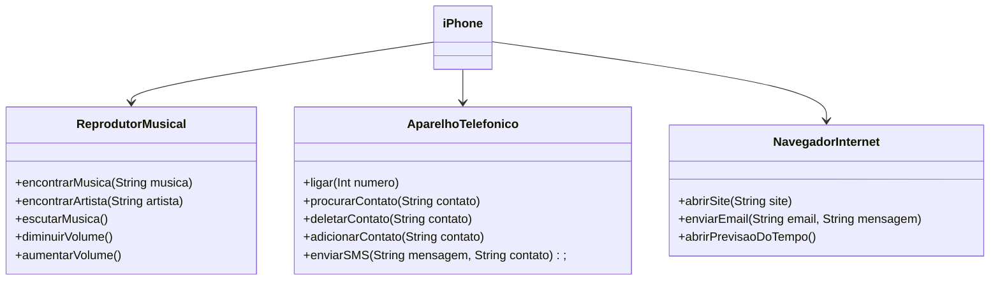

# Desafio POO

## Modelagem e Diagramação de um Componente iPhone

Desafio realizado ao final da trila de JAVA básico da plataforma DIO:

- O desafio consiste em utilizar uma ferramenta UML para criar o diagrama das classes e interfaces do componente iPhone, abrangendo suas funcionalidades como Reprodutor Musical, Aparelho Telefônico e Navegador na Internet.
  
- [Lançamento iPhone 2007](https://www.youtube.com/watch?v=9ou608QQRq8)

- ### Diagrama UML (Mermaid)

